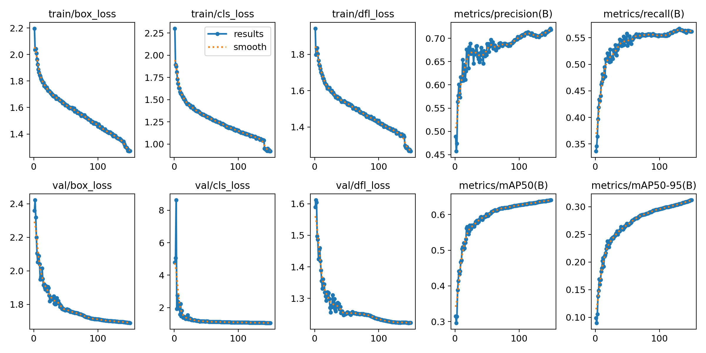
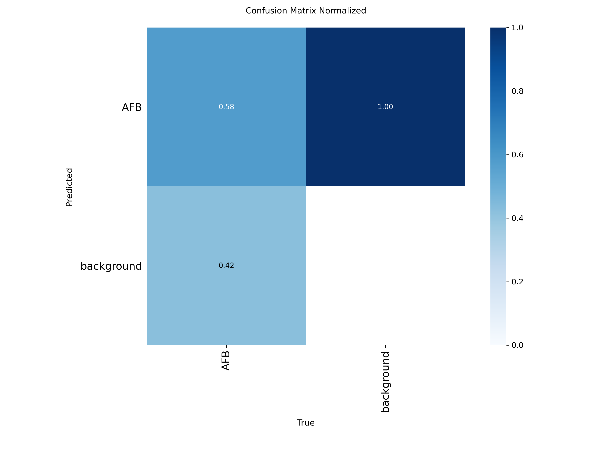
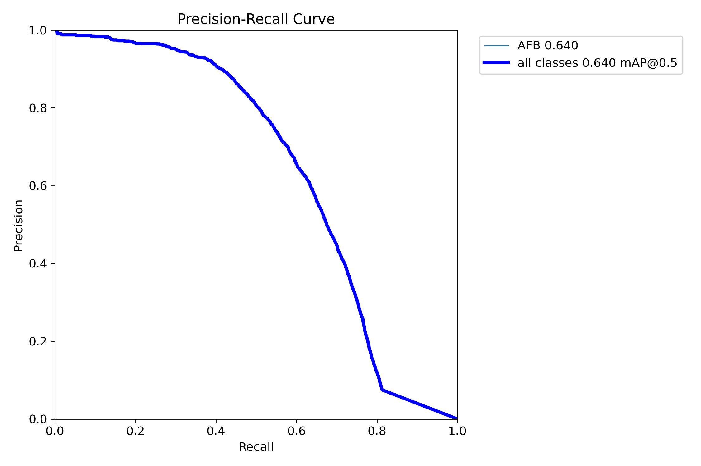
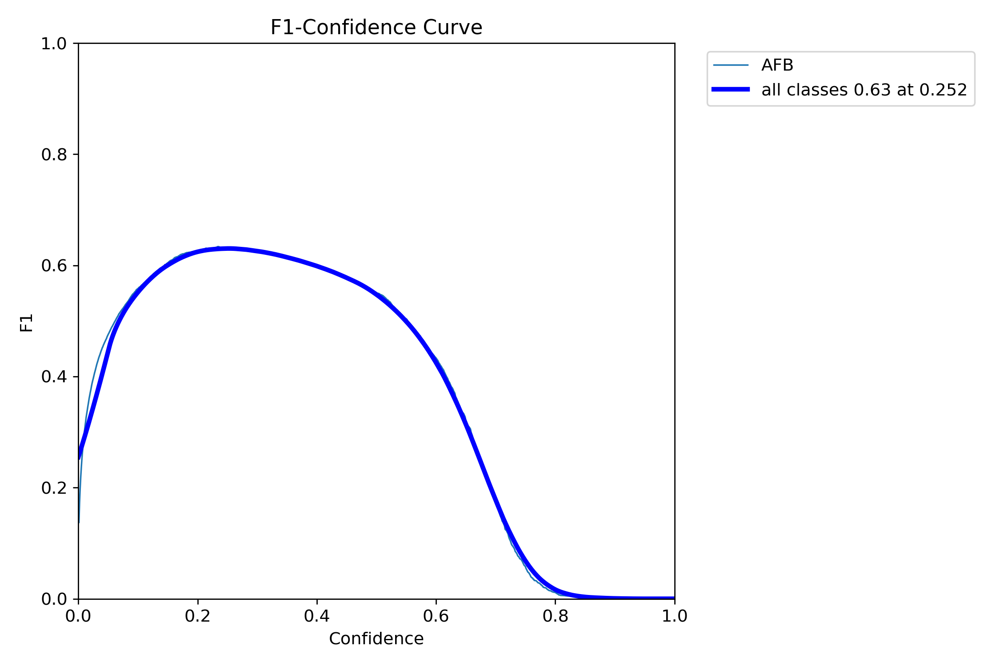

# TB-AFB Detection Clinical & Research Pipeline

### [Open the Live Project Site & Evaluation Dashboard →](https://abusuraihsakhri.github.io/pretrained-tb-afb-detection-engine/)

[](https://github.com/abusuraihsakhri/pretrained-tb-afb-detection-engine)
[](https://pytorch.org/)
[](LICENSE)
[](https://github.com/abusuraihsakhri/pretrained-tb-afb-detection-engine)
[](https://github.com/abusuraihsakhri/pretrained-tb-afb-detection-engine)

A clinical-grade, GPU-accelerated computer vision engine for detecting **Acid-Fast Bacilli (AFB)** (*Mycobacterium tuberculosis*) in Ziehl-Neelsen (ZN) stained microscopic sputum smears and Whole Slide Images (WSIs), trained across **14,951 multi-center microscopy fields** (**59,518 annotated AFB bacilli** across 9 global cohorts). Features full PyTorch YOLOv8 detection, tiled sliding-window WSI inference with boundary-aware Non-Maximum Suppression (NMS), IUATLD/WHO clinical smear grading quantitation, and a FastAPI active learning review tool.

---

## 📊 Empirical Validation Results (150-Epoch Multi-Center Run)

The model was trained for **150 full epochs** across 13,136 tiles and evaluated against an unseen multi-center validation cohort consisting of **952 clinical high-power fields (6,280 AFB instances)**:

| Metric | Checkpoint Value | Clinical Description |
| :--- | :---: | :--- |
| **mAP@50** | **64.06%** (`0.6406`) | High sensitivity on minute, morphologically diverse bacilli |
| **Precision ($P$)** | **71.86%** (`0.7186`) | Minimizes false-positive alarms on staining debris and mucin |
| **Recall ($R$)** | **56.20%** (`0.5620`) | Robust capture rate across 9 disparate clinical microscope optics |
| **mAP@50-95** | **31.19%** (`0.3119`) | Precise rod boundary localization and tight bounding box regression |
| **Inference Latency** | **2.5 ms / tile** | Over 400 FPS throughput enabling real-time sliding window review |
| **Pre/Post-Process** | **0.2 ms / 1.0 ms** | Low latency streaming for gigapixel Whole Slide Images |
| **Validation Cohort** | **952 HPFs / 6,280 Rods** | Unseen multi-center evaluation across diverse staining protocols |

### 📈 Convergence & Evaluation Curves

| Training Loss & Convergence | Normalized Confusion Matrix |
| :---: | :---: |
|  |  |

| Precision-Recall Curve | F1-Confidence Calibration Curve |
| :---: | :---: |
|  |  |

*Trained weights are preserved and staged at [`03_MODELS/best.pt`](03_MODELS/best.pt) and [`best.pt`](best.pt).*

---

## 🩺 Clinical Use Cases & Deployment Workflows

1. **High-Throughput Smear Triage:** Automated pre-screening in high-burden diagnostic centers. Rapidly separates confirmed negative sputum smears from suspicious fields, reducing pathologist screening time by >75% and preventing diagnostic fatigue.
2. **Whole Slide Image (WSI) Digital Pathology:** Direct integration with digital pathology scanners (Aperio, Hamamatsu, 3DHISTECH) via OpenSlide. Performs 640×640 boundary-aware sliding-window tiling and coordinate re-projection to map AFB clusters across entire gigapixel glass surfaces.
3. **Point-of-Care & Edge Telepathology:** Compact neural architecture (3.01M parameters, 8.1 GFLOPs) allows deployment on portable digital microscopes, mobile diagnostic vans, and field clinics without requiring cloud infrastructure.
4. **Standardized Quantitation & IUATLD/WHO Grading:** Translates raw rod coordinates into standardized international clinical grades, providing consistent, reproducible reporting across clinical institutions.
5. **Pathologist Active Learning (Human-in-the-Loop):** Integrated browser-based review tool (`/ui/`) allows clinical teams to inspect borderline bacilli, adjust bounding boxes, and hot-mount fine-tuned weights for regional stain adaptation.

---

## 🔬 Multi-Center Clinical Datalake (14,951 Patches)

The model is trained on a diverse, multi-center digital pathology datalake aggregating **14,951 microscopic fields** with **59,518 expert-annotated AFB rods** and **7,242 verified negative background control fields**:

| # | Clinical Cohort / Source | Scope & Hardware | Train | Val | Test | Total Images | Annotated AFB |
| :-: | :--- | :--- | :-: | :-: | :-: | :-: | :-: |
| **1** | **SWU Tuberculosis Cohort 1** | Srinakharinwirot Univ (`v1`) | 3,468 | 144 | 69 | 3,681 | 10,774 |
| **2** | **SWU Tuberculosis Cohort 2** | Srinakharinwirot Univ (`v3`) | 2,660 | 0 | 127 | 2,787 | 9,969 |
| **3** | **Athar Microscopy Cohort** | High-density AFB Smears (`v1`) | 618 | 171 | 91 | 880 | 1,166 |
| **4** | **Naresuan University Cohort** | Overlapping/isolated rods (`v15`) | 500 | 68 | 63 | 631 | 1,944 |
| **5** | **Detection-TB Expansion** | Multi-institution smear cohort (`v5`) | 2,712 | 116 | 112 | 2,899 | 10,303 |
| **6** | **AFB-Detect Clinical Smears** | High-throughput digital smears (`v4`) | 1,904 | 136 | 68 | 2,108 | 8,817 |
| **7** | **Suci Aulia Pathology** | ZN diagnostic smear set (`v10`) | 259 | 75 | 37 | 371 | 1,959 |
| **8** | **Mendeley Academic Hayear** | Dual-camera raw clinical set | 856 | 214 | 268 | 1,338 | 11,447 |
| **9** | **Uganda AI-TB-ZN Controls** | Southwestern Uganda verified negatives | 200 | 28 | 28 | 256 | 0 (Pure Negatives) |
| | **Grand Total** | | **13,136** | **952** | **863** | **14,951** | **59,518** |

*All 14,951 images and 14,951 labels have passed strict automated tensor matrix symmetry audits with 0 corrupted files.*

---

## 🏛️ End-to-End System Architecture

```text
[ Whole Slide Image (.svs / .ndpi) or Raster Smear (.jpg / .png) ]
                           │
                           ▼
          [ OpenSlide / libVIPS Tiling Engine ]
          ├── Background Glass Masking (Otsu Thresholding)
          └── 640×640 Window Tiling (64px Adaptive Stride Overlap)
                           │
                           ▼
            [ Neural Detection Backbone ]
          ├── Architecture: YOLOv8n (3.01M Parameters)
          ├── Single-Class Target: Class 0 -> AFB Bacilli
          └── CUDA AMP Inference Engine (2.5ms / tile)
                           │
                           ▼
       [ Boundary-Aware Post-Processing Orchestrator ]
          ├── Coordinate Re-Projection (Local Tile -> Global Slide)
          └── Vectorized Global NMS (IoU = 0.45, Conf >= 0.25)
                           │
                           ▼
             [ IUATLD / WHO Smear Grader ]
          ├── IUATLD Scale Quantitation (Negative, Scanty, 1+, 2+, 3+)
          ├── High-Power Field (HPF) Normalized Density
          └── Structured Diagnostic Clinical PDF/JSON Export
```

---

## 📋 IUATLD / WHO Smear Grading Protocol

Smear grading strictly follows the International Union Against Tuberculosis and Lung Disease (IUATLD) and World Health Organization (WHO) clinical quantitation guidelines:

| Smear Grade | Microscopic Examination Criteria (1000× Oil Immersion HPF) | Clinical Interpretation |
| :--- | :--- | :--- |
| **Negative** | **0 AFB** observed across 100 High-Power Fields (HPF) | No acid-fast bacilli observed |
| **Scanty** | **1 – 9 AFB** observed across 100 High-Power Fields | Exact count recorded (e.g. Scanty 4/100) |
| **1+** | **10 – 99 AFB** observed across 100 High-Power Fields | Low-positive bacillary load |
| **2+** | **1 – 10 AFB per single HPF** (evaluated across 50 fields) | Moderate-positive bacillary load |
| **3+** | **> 10 AFB per single HPF** (evaluated across 20 fields) | High-positive bacillary load (highly infectious) |

---

## 🚀 Quickstart & Inference

### 1. Environment Setup
```bash
git clone https://github.com/abusuraihsakhri/pretrained-tb-afb-detection-engine.git
cd pretrained-tb-afb-detection-engine
pip install -r requirements.txt
```

### 2. Verify Datalake Integrity
```bash
python 02_CODE/scripts/check_data_integrity.py
```

### 3. Run Inference with Fine-Tuned Checkpoint
```bash
python 02_CODE/scripts/04_inference.py \
  --model 03_MODELS/best.pt \
  --wsi 01_DATA/processed_tiles/test/images/acad_mendeley_Screenshot_101.png \
  --conf 0.25 \
  --fields-examined 100
```

### 4. Start the Web UI & FastAPI Server
```bash
uvicorn 05_DEPLOYMENT.api.server:app --host 127.0.0.1 --port 8001
```
Open your browser to `http://127.0.0.1:8001/ui/` for the interactive slide viewer and pathologist annotation tool.

---

## 📁 Repository Layout

```text
├── 01_DATA/
│   ├── processed_tiles/        # Standardized train/val/test images & YOLO labels
│   └── raw_academic/           # Academic archives (Mendeley, Uganda AI-TB)
├── 02_CODE/
│   ├── data.yaml               # Single-class dataset configuration
│   ├── scripts/                # Ingestion, audit, training, and inference scripts
│   └── src/tb_afb/             # Core detector, WSI tiler, postprocessor, grader
├── 03_MODELS/                  # Staged best.pt weights and release checkpoints
├── 05_DEPLOYMENT/              # FastAPI server, static viewer & annotation UI
├── 06_LOGS/
│   └── training/latest/        # Final training curves, confusion matrix, and results.csv
├── docs/                       # Live GitHub Pages research portal & visual assets
└── tests/                      # Automated test suites
```

---

## ⚖️ License & Clinical Disclaimer

Distributed under the **Apache License 2.0**.

> **Research and Investigational Use Only**: This software is intended for computer vision research, method development, and clinical evaluation. It is not an FDA/CE-IVD approved diagnostic medical device. Diagnostic decisions should always be confirmed by certified clinical pathologists and validated laboratory protocols.
